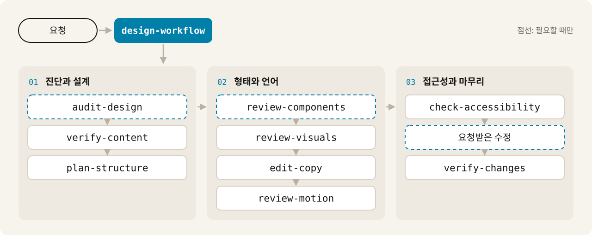

<div align="center">

<picture>
  <source media="(prefers-color-scheme: dark)" srcset=".github/assets/banner-dark.svg">
  
</picture>

<h3>근거 없는 주장, 뻔한 카피, 사용자의 작업에 도움이 되지 않는 디자인을<br>찾아내는 인터페이스 검토용 Agent Skills</h3>

<a href="https://github.com/fromiron/leeskills/actions/workflows/validate.yml"></a>


<a href="LICENSE"></a>

[English](README.md) · **한국어** · [日本語](README.ja.md)

[빠르게 시작하기](#빠르게-시작하기) · [동작 방식](#동작-방식) · [스킬 목록](#스킬-목록) · [받게 되는 결과](#받게-되는-결과) · [문서](#문서)

</div>

<br>

leeskills는 코딩·디자인 에이전트에 검토용 스킬 10개를 더합니다. 검토 범위를
정하는 워크플로 스킬 1개와, 콘텐츠·정보 구조·컴포넌트·시각 체계·카피·모션·
접근성·최종 검증을 맡는 집중 스킬 9개입니다. 영어, 한국어, 일본어를 지원합니다.

> [!NOTE]
> 스킬은 눈앞의 결과물만 판단합니다. 누가 만들었는지, AI를 썼는지는 추측하지
> 않고, 빈 곳을 지어낸 고객명이나 수치, 후기, 성과로 채우지 않습니다.

## 빠르게 시작하기

```bash
npx skills add fromiron/leeskills
```

공개 [`skills` CLI](https://skills.sh/docs/cli)가 이 GitHub 저장소를 가져와
`skills/` 아래의 패키지를 설치합니다. npm 배포는 없습니다. 설치한 뒤에는 평소
말하듯 요청하면 됩니다.

```text
이 랜딩 페이지를 leeskills로 검토해 줘. 근거 없는 카피와 필요 없는 디자인을
찾되, 제품의 말투와 중요한 기능, 접근성은 그대로 둬. 직접 확인한 내용과
추정한 내용을 구분하고, 꼭 필요한 만큼만 고친 뒤 핵심 흐름을 다시 확인해 줘.
```

목록을 먼저 보거나 워크플로 스킬만 설치할 수도 있습니다.

```bash
npx skills add fromiron/leeskills --list
npx skills add fromiron/leeskills --skill design-workflow
```

`design-workflow`만 설치하면 제한된 검토만 합니다. 빠진 전문 스킬을 알려 주고,
점수·판정·토큰 페이지 렌더링은 하지 않습니다. 전체 워크플로에는 전체 카탈로그를
설치하세요.

> [!TIP]
> `anti-ai-slop` 같은 이전 이름으로 설치했다면 [이름 전환 안내](docs/skill-name-migration.md)를
> 따르세요. 직접 수정한 내용을 보존하고, 구이름과 새 이름이 함께 등록되지 않게
> 하는 절차입니다.

## 동작 방식

화면 전체를 볼 때는 `design-workflow`로 시작하세요. 결과물에 필요한 단계만 골라
연결합니다. 그림은 새 인터페이스를 검토할 때의 전체 경로입니다. 범위가 좁으면
맞는 집중 스킬 하나만 쓰면 됩니다.

<picture>
  <source media="(prefers-color-scheme: dark)" srcset=".github/assets/workflow-ko-dark.svg">
  
</picture>

점선 단계는 필요할 때만 실행합니다. 기존 결과물이면 `audit-design`, 재사용
컴포넌트가 범위에 있으면 `review-components`, 수정을 요청했으면 수정 단계가
들어갑니다. 검토만 요청하면 결과물 파일은 바꾸지 않습니다.

## 스킬 목록

| 스킬 | 결과 |
|---|---|
| **`design-workflow`**<br>인터페이스 전체 검토 | 범위에 맞춘 스킬 순서와 하나로 정리한 결과 |
| **`audit-design`**<br>기존 결과물 진단 | 확인한 문제, 위험 점수, 정리 순서 |
| **`verify-content`**<br>출처가 뒷받침하는 주장 확인 | 출처가 연결된 콘텐츠 목록과 비어 있는 항목 |
| **`plan-structure`**<br>콘텐츠 순서와 탐색 구조 결정 | 사용자 작업 기준의 구조와 제외한 대안 |
| **`review-components`**<br>재사용 UI 규칙 정리 | 구조, 상태, 동작, 접근성, 담당 범위, 디자인과 코드의 차이 |
| **`review-visuals`**<br>시각 체계 정리 | 시각 규칙, 반응형·타이포그래피·중첩 모서리 반경 검사, 요청하면 AI 자동 분석이나 몇 가지 질문에 대한 답으로 만든 토큰 제안과, 색을 hex·rgb()·oklch()로 함께 보여 주는 HTML 페이지 |
| **`edit-copy`**<br>제품 문구 다듬기 | 근거가 있고 제품 말투와 각 언어에 맞는 문구 |
| **`review-motion`**<br>애니메이션과 전환 검토 | 유지·축소·대체·삭제 판단과 모션 감소 대응 |
| **`check-accessibility`**<br>접근성을 지키며 단순화 | 문서 구조, 키보드, 포커스, 리플로, 대비, 상태 검사 |
| **`verify-changes`**<br>수정한 결과 확인 | 좁은 변경에는 변경 범위 검사, 릴리스 판단에는 삭제·확장·리플로·출처·핵심 작업 전체 검사 |

`verify-content`는 무엇을 말해도 되는지, `edit-copy`는 어떻게 말할지를
정합니다. 카드나 그라디언트, 모션 자체를 금지하지는 않습니다. 사용자 작업에
도움이 되고 남길 이유가 있으면 그대로 둡니다.

<details>
<summary><b>자주 쓰는 순서</b></summary>

<br>

| 상황 | 순서 |
|---|---|
| 새 인터페이스나 랜딩 페이지 | `verify-content` → `plan-structure` → `review-visuals` → `edit-copy` → `review-motion` → `check-accessibility` → 수정 → `verify-changes` |
| 기존 인터페이스 | `audit-design` → 필요한 집중 스킬 → 수정 → `verify-changes` |
| 디자인 시스템이나 컴포넌트 | `review-components` → `review-visuals` → `check-accessibility` → 수정 → `verify-changes` |
| 카피만 | `verify-content` → `edit-copy` → 수정 → 변경 범위 `verify-changes` |

수정 단계는 변경을 요청한 경우에만 실행합니다.

</details>

## 받게 되는 결과

| 요청 | 결과 |
|---|---|
| **검토** | 문제마다 위치, 근거, 최소 수정안, 확인 방법. 결과물 파일은 바꾸지 않습니다. |
| **수정** | 실제 변경 후 최종 확인, 실행한 검사, 확인하지 못한 항목, 되돌리는 방법 |
| **작은 초안 훑어보기** | `audit-design`의 quick pass. 점수나 출시 판정 없이 5개 이하로 추린 지적과 건너뛴 검사 목록 |

검토 결과는 다음과 같은 형식입니다. 아래 내용은 형식을 보여 주기 위한 예시이며,
실제 제품을 검토한 결과가 아닙니다.

```text
Observed · 히어로 제목 · src/pages/index.html:14
  근거    "업무 효율을 극대화하세요"에 대응하는 사실이 콘텐츠 목록에 없습니다.
  수정    지원하는 내보내기 형식처럼 제공된 사실로 바꿉니다.
  확인    verify-content를 다시 실행해 제목이 출처와 연결되는지 확인합니다.
```

중요한 지적에는 다음 근거 표시 중 하나를 붙입니다.

| 표시 | 뜻 |
|---|---|
|  | 제공된 문구, 화면, 마크업, 코드, 디자인 파일, 토큰에서 바로 확인한 내용 |
|  | 결정적인 테스트나 계산으로 나온 값 |
|  | 근거로 뒷받침되지만 직접 확인하지는 못한 내용 |
|  | 제공된 자료만으로는 알 수 없는 내용 |

확인할 수 없는 내용은 확인할 수 없다고 적습니다. 다른 요청 예시와 데이터 예시는
[`examples/`](examples/README.md)에 있습니다.

## 설치 방법

<details>
<summary><b>클라이언트별 어댑터</b></summary>

<br>

클라이언트별 안내는 [Codex](adapters/codex/README.md),
[Claude Code](adapters/claude-code/README.md),
[범용](adapters/generic/README.md) 어댑터 문서에 있습니다. 스킬 자동 탐색이 없는
클라이언트는 [수동 통합 예시](examples/manual-agent-integration.md)를 참고하세요.

</details>

<details>
<summary><b>복제한 저장소에서 설치</b></summary>

<br>

복제한 저장소에서 설치하거나 원하는 폴더에 설치할 때는 저장소에 포함된 설치기를
씁니다. 실제로 파일을 쓰려면 `--dry-run`을 빼세요. `--force`를 붙이지 않으면
기존 스킬을 덮어쓰지 않습니다.

```bash
python scripts/install.py --client codex --scope repo --mode copy --dry-run
python scripts/install.py --client claude-code --scope repo --mode copy --dry-run
python scripts/install.py --client generic --target /path/to/skills --mode copy --dry-run
```

</details>

## 패키지 구조

<details>
<summary><b>스킬 하나의 구성</b></summary>

<br>

```text
skill-name/
├── SKILL.md      # 스킬 지침
├── references/   # 필요할 때 읽는 자료
├── assets/       # 스키마와 템플릿
├── scripts/      # 선택형 반복 검사
└── evals/        # 트리거·출력 평가 항목
```

- `SKILL.md`는 공개 Agent Skills의 frontmatter 필드만 사용합니다.
- 판단 기준은 Markdown에 있습니다. 필수 필드나 파일 구조처럼 반복해서 확인할
  수 있는 항목은 선택형 Python 3.9+ 스크립트가 검사합니다. 표준 라이브러리만
  쓰고, 비대화형으로 실행되며, 네트워크에 연결하지 않습니다.
- 트리거 평가 항목은 영어·한국어·일본어 예시와, 비슷해 보여도 호출되면 안 되는
  예시를 함께 담습니다. [evals/](evals/README.md)에는 전체 카탈로그 라우팅 사례와
  실행 기록 형식이 있습니다. 평가 항목이 다루는 범위를 확인할 뿐, 실제 클라이언트의
  호출률을 측정하지는 않으며 아직 기록된 실행은 없습니다.

</details>

## 개발

```bash
make check
```

`python scripts/validate_repo.py`와 `python -m unittest discover -s tests -v`를
실행합니다. `make`가 없으면 두 명령을 직접 실행하세요. 사용하는 Python 3.9+
실행기에 따라 `python3`이나 `py -3`을 써도 됩니다. CI는 Ubuntu와 Windows에서
Python 3.9와 3.12로 같은 검사를 실행합니다. 스킬을 추가하기 전에
[CONTRIBUTING.md](CONTRIBUTING.md)를 확인하세요.

## 문서

| 문서 | 내용 |
|---|---|
| [아키텍처](docs/architecture.md) | 구성, 데이터 계약, 이식 범위 |
| [통합](docs/integration.md) | 클라이언트 설정과 호출 방식 |
| [이름 전환](docs/skill-name-migration.md) | 구이름·새 이름 대응표와 기존 설치본 전환 |
| [평가](docs/evaluation.md) | 호출 측정, 결과 비교, 릴리스 기준 |
| [디자인 기초](docs/design-foundations.md) | 스킬이 따르는 제품·디자인 원칙 |
| [출처 노트](docs/source-notes.md) | 출처와 외부 지침을 다루는 방식 |
| [변경 기록](CHANGELOG.md) | 릴리스 이력 |

## 라이선스

[MIT](LICENSE)
