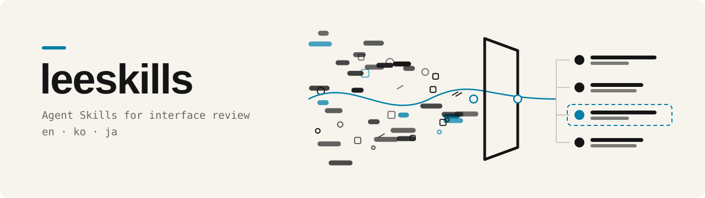
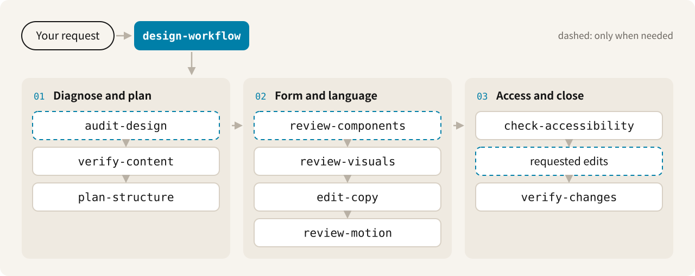

<div align="center">

<picture>
  <source media="(prefers-color-scheme: dark)" srcset=".github/assets/banner-dark.svg">
  
</picture>

<h3>Review interface work for unsupported claims, generic copy,<br>and design that does not help the user's task.</h3>

<a href="https://github.com/fromiron/leeskills/actions/workflows/validate.yml"></a>


<a href="LICENSE"></a>

**English** · [한국어](README.ko.md) · [日本語](README.ja.md)

[Quick start](#quick-start) · [How it works](#how-it-works) · [Skills](#skills) · [What you get back](#what-you-get-back) · [Docs](#documentation)

</div>

<br>

leeskills gives a coding or design agent ten review skills: one workflow skill
that plans the review, and nine focused skills for content, information
structure, components, visual systems, copy, motion, accessibility, and final
verification. They work in English, Korean, and Japanese.

> [!NOTE]
> The skills judge the artifact in front of them. They do not guess who made it
> or whether AI was involved, and they do not fill gaps with invented customers,
> metrics, quotes, or results.

## Quick start

```bash
npx skills add fromiron/leeskills
```

The open [`skills` CLI](https://skills.sh/docs/cli) fetches this GitHub
repository and installs the packages under `skills/`. Nothing is published to
npm. Then ask your agent in plain language:

```text
Review this landing page with leeskills. Point out generic copy, unsupported
claims, and design choices that do not help the main task. Keep the product's
actual voice, required actions, and accessibility. Separate observations from
inferences, make the smallest complete fix, and check the main flow again.
```

To inspect the catalog or install only the workflow skill:

```bash
npx skills add fromiron/leeskills --list
npx skills add fromiron/leeskills --skill design-workflow
```

> [!TIP]
> Upgrading from the previous skill names, such as `anti-ai-slop`? Follow the
> [migration guide](docs/skill-name-migration.md) so local changes are kept and
> old and new packages are not both discovered.

## How it works

Start with `design-workflow` for a broad review. It picks only the steps the
artifact needs; the diagram shows the full route for a new interface. Use a
single focused skill when the job is narrow.

<picture>
  <source media="(prefers-color-scheme: dark)" srcset=".github/assets/workflow-en-dark.svg">
  
</picture>

Dashed steps run only when needed: `audit-design` for an existing artifact,
`review-components` when reusable components are in scope, and edits when you
ask for them. Review-only requests leave artifact files unchanged.

## Skills

| Skill | Output |
|---|---|
| **`design-workflow`**<br>Review an interface end to end | A scoped sequence of skills and one combined result |
| **`audit-design`**<br>Diagnose an existing artifact | Observed problems, risk scores, and a cleanup order |
| **`verify-content`**<br>Check which claims the sources support | A source-traced content inventory with gaps left visible |
| **`plan-structure`**<br>Choose content order and navigation | A task-based structure, with rejected options recorded |
| **`review-components`**<br>Define a reusable UI contract | Anatomy, states, behavior, accessibility, ownership, and design-code parity |
| **`review-visuals`**<br>Tighten the visual system | A visual budget; responsive, typography, and nested-radius checks; and an optional HTML token proposal page rendered from validated JSON |
| **`edit-copy`**<br>Edit product copy | Specific, supported copy in the product's voice for each locale |
| **`review-motion`**<br>Review animation and transitions | Keep, reduce, replace, or remove decisions, with reduced-motion support |
| **`check-accessibility`**<br>Simplify without losing access | Semantics, keyboard, focus, reflow, contrast, and status checks |
| **`verify-changes`**<br>Check the finished work | Deletion, growth, reflow, provenance, and primary-task checks |

`verify-content` decides what may be claimed; `edit-copy` decides how to say
it. Cards, gradients, and motion are not banned. They stay when they help the
task and there is a reason for them.

<details>
<summary><b>Typical sequences</b></summary>

<br>

| Situation | Sequence |
|---|---|
| New interface or landing page | `verify-content` → `plan-structure` → `review-visuals` → `edit-copy` → `review-motion` → `check-accessibility` → edits → `verify-changes` |
| Existing interface | `audit-design` → focused skills as needed → edits → `verify-changes` |
| Design system or component | `review-components` → `review-visuals` → `check-accessibility` → edits → `verify-changes` |
| Copy only | `verify-content` → `edit-copy` → edits → `verify-changes` |

The edit step runs only when you ask for changes.

</details>

## What you get back

| You ask for | You receive |
|---|---|
| **A review** | Each finding with its location, evidence, the smallest fix, and how to verify it. Artifact files stay unchanged. |
| **Edits** | The actual changes, then a final check, the checks run, items left unverified, and how to roll back. |
| **A quick look** at a small draft | The `audit-design` quick pass: up to five findings, no score or release verdict, and a list of skipped checks. |

A review finding reads like this. The content below is an illustration of the
format, not output from a real product.

```text
Observed · Hero headline · src/pages/index.html:14
  Evidence  "Supercharge your workflow" has no matching fact in the content inventory.
  Fix       Replace it with a supplied fact, such as the supported export formats.
  Verify    Re-run verify-content and confirm the headline maps to a source.
```

Every material finding carries one evidence label:

| Label | Meaning |
|---|---|
|  | Shown directly by the supplied copy, screenshot, markup, code, design file, or tokens |
|  | Produced by a deterministic test or calculation |
|  | Supported by the evidence, but not shown directly |
|  | The supplied material cannot answer it |

When something cannot be checked, the report says so. More requests and data
examples are in [`examples/`](examples/README.md).

## Install options

<details>
<summary><b>Client adapters</b></summary>

<br>

Client-specific notes are in the [Codex](adapters/codex/README.md),
[Claude Code](adapters/claude-code/README.md), and
[generic](adapters/generic/README.md) adapters. For clients without native skill
discovery, see the [manual integration example](examples/manual-agent-integration.md).

</details>

<details>
<summary><b>Install from a clone</b></summary>

<br>

Use the bundled installer to install from a clone or into a specific folder.
Remove `--dry-run` to write files. It does not overwrite existing skills unless
you pass `--force`.

```bash
python scripts/install.py --client codex --scope repo --mode copy --dry-run
python scripts/install.py --client claude-code --scope repo --mode copy --dry-run
python scripts/install.py --client generic --target /path/to/skills --mode copy --dry-run
```

</details>

## Package layout

<details>
<summary><b>Inside each skill</b></summary>

<br>

```text
skill-name/
├── SKILL.md      # instructions
├── references/   # material loaded when needed
├── assets/       # schemas and templates
├── scripts/      # optional repeatable checks
└── evals/        # trigger and output fixtures
```

- `SKILL.md` files use only open Agent Skills frontmatter fields.
- Judgment lives in Markdown. Repeatable checks, such as required fields and
  file structure, are optional Python 3.9+ scripts that use only the standard
  library, run non-interactively, and make no network requests.
- Trigger fixtures cover English, Korean, and Japanese, including near-miss
  negatives. They check fixture coverage, not real activation rates in a
  client.

</details>

## Development

```bash
make check
```

This runs `python scripts/validate_repo.py` and
`python -m unittest discover -s tests -v`. Without `make`, run those two
commands directly; use `python3` or `py -3` if that is your Python 3.9+
launcher. CI runs the same checks on Ubuntu and Windows with Python 3.9 and
3.12. See [CONTRIBUTING.md](CONTRIBUTING.md) before adding a skill.

## Documentation

| Document | Contents |
|---|---|
| [Architecture](docs/architecture.md) | Composition, data contracts, and portability boundaries |
| [Integration](docs/integration.md) | Client setup and invocation strategy |
| [Name migration](docs/skill-name-migration.md) | Old-to-new names and safe installation updates |
| [Evaluation](docs/evaluation.md) | Trigger measurement, output comparison, and release gates |
| [Design foundations](docs/design-foundations.md) | Product and design principles used by the skills |
| [Source notes](docs/source-notes.md) | Provenance and the use of outside guidance |
| [Changelog](CHANGELOG.md) | Release history |

## License

[MIT](LICENSE)
